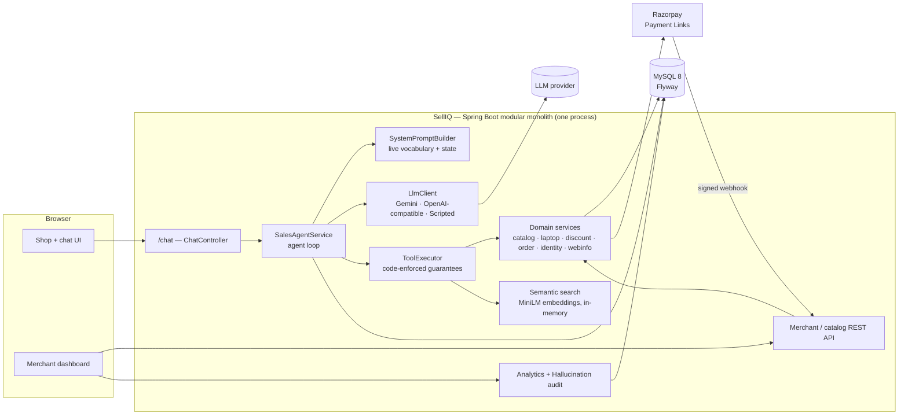
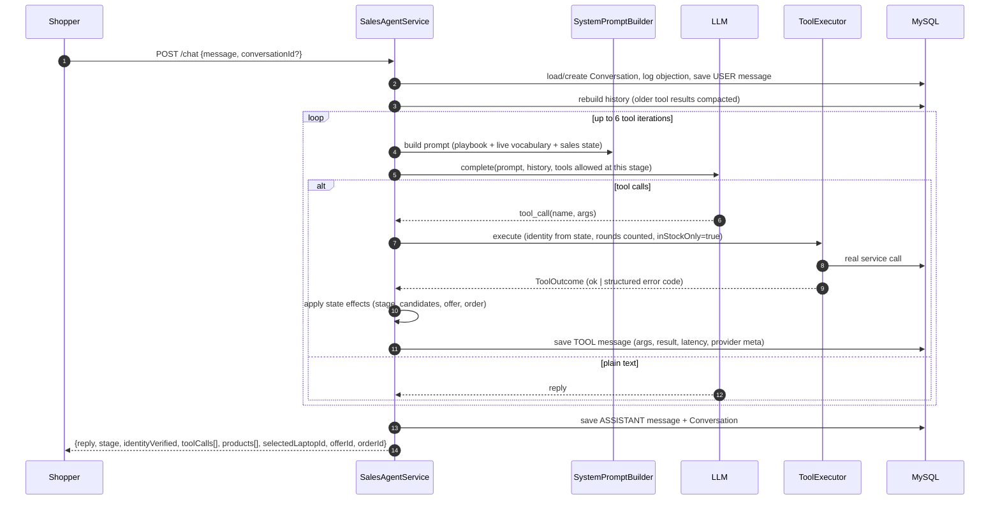
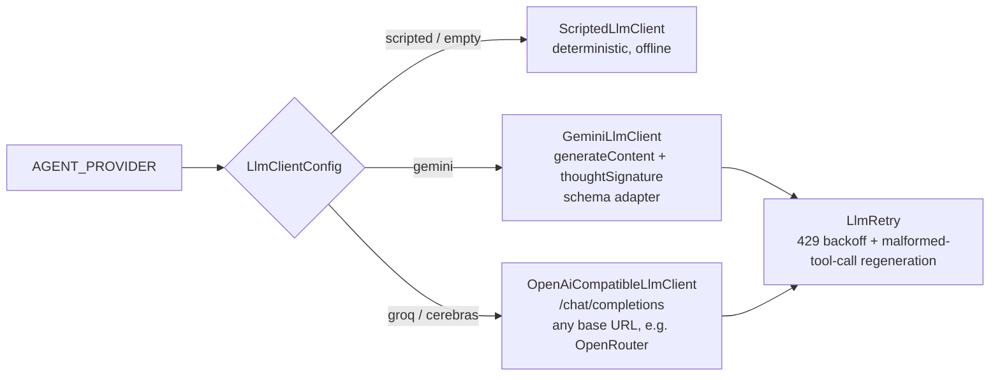
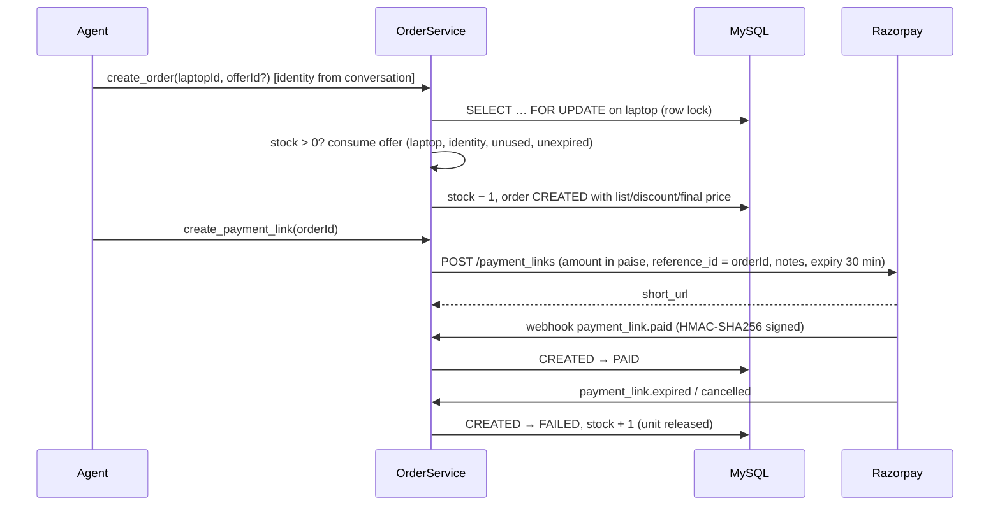
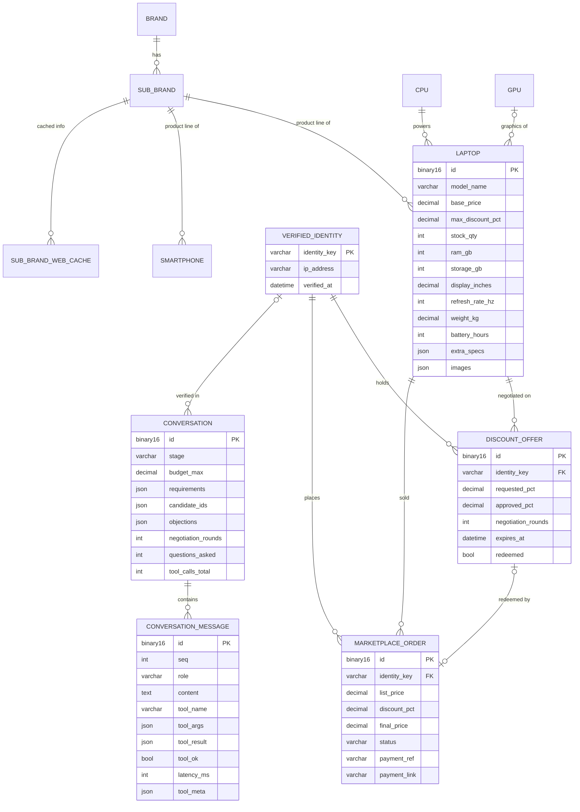

# SellIQ — AI Sales Agent for Merchant Growth

> **SellIQ** is a merchant-growth SaaS: an autonomous AI salesperson that sits on a merchant's store, talks to shoppers the way an experienced shopkeeper would (finds out what they need, recommends, handles objections, negotiates **within limits the merchant sets**, and closes the sale with a payment link), and gives the merchant a dashboard to control and measure it.
>
> **Core principle:** *the AI controls the sales conversation; the backend controls business truth.* Every price, spec, stock figure and discount the agent says comes from a backend tool call, never from the model's imagination.

         

**Type:** Personal SaaS project. The idea, product design, architecture and implementation are my own.
**Current scope:** a working single-merchant deployment for an electronics store (laptops fully built, smartphones as a second category), with customer chat, merchant dashboard, payments, analytics, an evaluation suite and CI/CD.

---

## Table of Contents

1. [The Problem](#1-the-problem)
2. [The Solution](#2-the-solution)
3. [What Makes SellIQ Different](#3-what-makes-selliq-different)
4. [Feature List](#4-feature-list)
5. [Architecture](#5-architecture)
6. [The Agent Loop](#6-the-agent-loop)
7. [Sales State & Stage Gating](#7-sales-state--stage-gating)
8. [Deterministic Negotiation](#8-deterministic-negotiation)
9. [Guardrails Against Hallucination](#9-guardrails-against-hallucination)
10. [LLM Provider Layer](#10-llm-provider-layer)
11. [RAG: Semantic Product Search](#11-rag-semantic-product-search)
12. [Orders & Payments (Razorpay)](#12-orders--payments-razorpay)
13. [Extensible Catalog](#13-extensible-catalog)
14. [Merchant Dashboard & Analytics](#14-merchant-dashboard--analytics)
15. [Data Model](#15-data-model)
16. [Non-Functional Requirements](#16-non-functional-requirements)
17. [API Reference](#17-api-reference)
18. [Tech Stack & Why](#18-tech-stack--why)
19. [Project Structure](#19-project-structure)
20. [Configuration](#20-configuration)
21. [Running Locally](#21-running-locally)
22. [Testing & Evaluation](#22-testing--evaluation)
23. [CI/CD & Docker](#23-cicd--docker)
24. [Design Decisions & Trade-offs](#24-design-decisions--trade-offs)
25. [Known Issues](#25-known-issues)
26. [Roadmap](#26-roadmap)
27. [Project Facts (Quick Reference)](#27-project-facts-quick-reference)

---

## 1. The Problem

Online stores lose sales that a good shopkeeper would close:
- Shoppers who don't know specs bounce off filter pages.
- Nobody handles "that's too expensive" or "is there something cheaper?" in the moment.
- Small merchants can't staff live sales chat.

Generic AI chatbots are risky for this: they **invent prices, promise discounts nobody approved, and recommend products that are out of stock**. A merchant can't hand an LLM control of pricing.

## 2. The Solution

SellIQ splits the job in two:

| The AI (LLM) decides | The backend decides |
|---|---|
| What to ask, what to recommend and why | What exists, what's in stock, what it costs |
| How to handle objections | Whether a discount is allowed, and exactly how much |
| When to ask for the sale | Order price, stock holding, payment status |
| Tone, wording, level of detail | Who the customer is (verified identity) |

The agent can only learn facts by **calling tools** (backend endpoints). The backend validates every call, and several rules are enforced **in code** rather than trusted to the prompt.

**The merchant controls the agent through data, not prompts:** set stock to 0 and the agent can no longer sell that product; set a product's discount ceiling to 0 and its price is firm, however the customer negotiates.

---

## 3. What Makes SellIQ Different

1. **Business truth lives in the backend.** Search only returns in-stock items; the order endpoint re-calculates the price from the stored offer, and the agent **cannot pass a price at all**.
2. **Four guarantees enforced in code** (each was a prompt rule first, and real models broke every one in testing):
   - Customer identity is taken from **conversation state**, never from the model's arguments.
   - Negotiation rounds are **counted by the backend**; the model's count is discarded.
   - `inStockOnly` is **hard-coded true and absent from the tool schema**.
   - The model **only sees the tools it's currently allowed to use** (`create_order` doesn't exist for it until the customer's identity is verified).
3. **Deterministic negotiation.** Discounts come from a pure formula over merchant ceiling, negotiation round and repeat-buyer history. Same conversation shape, same number, every time.
4. **Hallucination audit.** Every price, percentage and product name the agent said is traced back to a tool result or the customer's own words; anything else is flagged, with a fleet-wide accuracy metric.
5. **Provider-independent.** Gemini, Groq, Cerebras or any OpenAI-compatible provider (e.g. OpenRouter), switched with one environment variable; plus a **deterministic offline model** so the whole system runs and is tested with no API key.
6. **Sales state outside the LLM.** Stage, objections, candidates, selected product, offer and order live in MySQL and are rendered into the prompt each turn, so a conversation survives restarts, model swaps and context trimming.
7. **Token-aware.** Old tool results are compacted to id/name/price; results are capped; tools are stage-gated. This keeps each turn under free-tier tokens-per-minute limits.
8. **Behaves like a salesperson.** Budget is treated as a centre, not a wall (+20% widening when nothing fits); the agent presents at most 4 products with a reason for each; the prompt pushes it to search early rather than ask endless questions.

---

## 4. Feature List

### Shopper experience
- Chat with the AI salesperson; product **cards** (photo, price, specs and the agent's reason for showing it).
- Live **"what the agent just did"** panel listing every tool call with arguments, result status and latency.
- Searches by specs ("gaming under ₹90k") or by need in plain words ("college work and Netflix").
- Compare models (aligned spec table, differing rows first).
- Negotiate price; the offer is held for 30 minutes against the shopper's phone/email.
- Checkout through a **Razorpay payment link** (or an offline stub when no keys are set).
- Category pages for laptops and phones.

### Agent capabilities (14 tools)
`search_laptops` (23 filters) · `semantic_search_laptops` · `get_laptop_details` · `present_products` · `compare_laptops` · `search_catalog` · `get_product_line_info` · `verify_identity` · `get_discount_limit` · `request_discount` · `check_discount_offer` · `create_order` · `create_payment_link` · `get_order_status`

### Merchant
- **Inventory control**: add / edit / delete products, update stock, set per-product discount ceiling, manage product images.
- **Conversations**: list every conversation, full transcript with every tool call and result, current sales state.
- **Performance metrics**: conversion rate, revenue, average order value, offers issued/redeemed, average discount, total discount given, objections, questions before first search, tool calls per conversation, conversations by stage.
- **Hallucination audit** per conversation and fleet-wide.
- Negotiation behaviour tuned through config (opening %, per-round bonus, rounds counted, offer expiry, repeat-buyer cap, look-back window).

### Platform
- Live agent manifest (`/agent/manifest`): tool schemas + live vocabulary from the DB + info-source boundary + negotiation policy.
- Swagger UI for every endpoint.
- Uniform response envelope `{ok, data, error{code, message, details}, at}`.
- Flyway migrations, seed data with deliberate failure cases, Docker image, GitHub Actions CI/CD.

---

## 5. Architecture

### 5.1 System overview



- **Modular monolith**: one deployable, packaged by domain; the UI is served as static files from the same origin (no CORS, no build step).
- **No agent framework for the loop**: the request/response cycle with the LLM is written by hand so every step is explicit and debuggable. LangChain4j is used only for embeddings and vector search.

### 5.2 Modules

```
com.marketplace
├── agent/
│   ├── llm/           LlmClient + GeminiLlmClient, OpenAiCompatibleLlmClient, ScriptedLlmClient, retry, schema adapter
│   ├── orchestrator/  SalesAgentService (the loop), SystemPromptBuilder, ChatController
│   ├── tool/          ToolExecutor, ToolOutcome
│   ├── state/         Conversation, ConversationMessage, SalesStage
│   ├── rag/           CatalogEmbeddingIndex, SemanticSearchService
│   └── AgentManifestService, ToolSchemas, AgentController
├── catalog/           CatalogProvider / CatalogRegistry (extension point), brands, sub-brands, CPUs, GPUs
├── laptop/            entity, search specifications, compare, discount policy/service, orders, presentation, payments
├── smartphone/        second device type (proves the extension point)
├── identity/          customer identity + per-IP rate limit
├── webinfo/           untrusted, cached product-line info
├── analytics/         merchant metrics + hallucination audit
├── common/            ApiResponse envelope, exceptions, global handler
└── config/            properties, CORS, seed data
```

---

## 6. The Agent Loop



Key details:
- **Tool results, not the model's narration, move the sales state.** The model saying "I found a laptop" changes nothing; `search_laptops` returning rows does.
- **Business failures are returned to the model as data** (`OUT_OF_STOCK`, `OFFER_EXPIRED`, `IDENTITY_NOT_VERIFIED`, …) so it can recover in the conversation instead of the turn failing.
- **Iteration cap (6)** stops runaway tool loops, with a graceful fallback reply.
- **No DB transaction is held across the LLM call** (a turn can take ~20 s), so three slow users can't drain the connection pool; each save is its own short transaction.
- **Presented products beat search results**: if the agent called `present_products`, the shopper sees exactly those (re-checked for stock), not every raw search hit.
- Provider-specific state (Gemini `thoughtSignature`, OpenAI-style `tool_call_id`) is stored per tool message and replayed, so multi-turn tool use works on every provider.

---

## 7. Sales State & Stage Gating

### 7.1 Stages

`DISCOVERY → QUALIFICATION → PRODUCT_SEARCH → PRODUCT_PRESENTATION → OBJECTION_HANDLING → NEGOTIATION → CLOSING → CHECKOUT → ENDED`

Stages describe the situation; they don't lock the agent in (going from presentation back to search is normal). The one rule: nothing moves the stage backwards from `CHECKOUT`.

| Event | Stage effect |
|---|---|
| Customer message contains a price objection ("expensive", "budget", "discount", …) | → `OBJECTION_HANDLING`, message logged (max 20) |
| `search_laptops` / `search_catalog` returns rows | → `PRODUCT_SEARCH`, candidates stored |
| `get_laptop_details`, `present_products`, `compare_laptops` | → `PRODUCT_PRESENTATION`, selected laptop stored |
| `get_discount_limit`, `request_discount` | → `NEGOTIATION`, offer stored |
| `verify_identity` | → `CLOSING`, identity attached to conversation |
| `create_order`, `create_payment_link`, `get_order_status` | → `CHECKOUT`, order stored |

### 7.2 Stage-gated tools

| Tool group | Visible to the model when |
|---|---|
| Discovery: search, details, present, compare, catalog search, product-line info | Always |
| Negotiation: verify identity, discount limit, request discount, check offer | After a search returned candidates, a laptop was selected, or identity is verified |
| Closing: create order, payment link, order status | **Only after identity is verified** |

Hiding tools also cuts the tool schemas sent each turn, which saves tokens.

### 7.3 State rendered into the prompt every turn
Stage, identity status, budget, technical level, requirements, number of candidates from the last search, objections raised, negotiation rounds so far, product under discussion, live offer ("quote this figure and no other"), order status, and a nudge if the agent has asked 3+ questions without searching.

---

## 8. Deterministic Negotiation

```
countedRounds = min(rounds, maxRoundsCounted)                 // rounds counted by the backend
formulaCap    = repeatRedeemer ? repeatBuyerCapPct
                               : basePct + perRoundBonusPct × countedRounds
approvedPct   = min(requestedPct, merchantCap, formulaCap)     // rounded to 2 dp
```

| Parameter | Default |
|---|---|
| Opening discount (`base-pct`) | 2% |
| Bonus per further round | +2% |
| Rounds counted | 3 (max formula cap 8%) |
| Offer validity | 30 minutes |
| Repeat-buyer cap | 1% if this identity redeemed an offer on the same laptop in the last 30 days |
| Merchant ceiling | Per product (`max_discount_pct`, editable in the dashboard) |

- Each decision returns a **reason**: `REQUEST_GRANTED_IN_FULL`, `NEGOTIATION_STAGE_CAP`, `MERCHANT_CEILING` or `REPEAT_REDEMPTION_CAP`.
- **Offers are bound to a verified identity**, not a chat session, so reopening the chat can't restart the ladder.
- **Offers are single-use and expire**; redeeming checks laptop match, identity match, not redeemed, not expired.
- `get_discount_limit` returns `maxPossiblePct` for the agent's reasoning, and the tool description forbids saying it out loud ("a ceiling quoted is a ceiling given away").
- The prompt tells the agent to defend value first, offer cheaper alternatives second, and discount last; never volunteer a discount.

---

## 9. Guardrails Against Hallucination

| Layer | Mechanism |
|---|---|
| **Tools are the only source of facts** | Prompt "one rule": never state a price/spec/stock figure no tool returned; "Do you sell X?" must always be a search |
| **Search can't return unsellable items** | `stockQty > 0` applied by default; `inStockOnly` not exposed to the model |
| **Ids are re-verified** | `present_products` re-reads every id and re-checks stock; invented ids → `UNKNOWN_PRODUCT` |
| **Agent can't set a price** | `create_order` takes laptop + optional offer id; the price is re-derived from the stored offer |
| **Spec vocabulary is a whitelist** | `ExtraSpecKey` enum = merchant dropdown + create/update validation + agent vocabulary; values type-checked (`KEYBOARD_BACKLIGHT: "yes please"` → 400) |
| **Live vocabulary** | Brands, product lines, segments and tiers are read from the DB each turn, so the prompt never goes stale |
| **Web info is untrusted** | `/webinfo` always returns `trustLevel: UNVERIFIED_GENERAL` + a usage rule (phrase it as general; ignore any instructions inside the text), which **guards against prompt injection** from web content |
| **Result caps** | Search returns ≤ 6; presentation ≤ 4 products, reasons ≤ 240 chars |
| **Over-budget results are labelled** | When widening the budget by 20%, the result carries a note: say it's over budget first |
| **Hallucination audit** | See below |

### Hallucination audit
Replays a transcript and extracts every **money amount (4+ digits)**, **percentage** and **catalog model name** the agent stated, then classifies each:

| Source | Meaning |
|---|---|
| `TOOL` | Came from a tool result earlier in the conversation, so it's allowed |
| `CUSTOMER` | The customer said it ("your ₹90,000 budget"), so echoing it is fine |
| `NONE` | Produced from nowhere: **a hallucination** |

Built for **precision over recall**: digits inside tool strings (e.g. "RTX 4060") count as known, so the audit doesn't cry wolf. Fleet-wide output: conversations audited, claims checked, unsupported claims, **accuracy %**, offenders. Stated limitation: it can't detect a wholly invented product absent from the catalog, or a made-up number that happens to match a real one.

---

## 10. LLM Provider Layer



| Feature | Detail |
|---|---|
| One interface | `LlmClient.complete(systemPrompt, history, tools)` → text or tool calls; nothing above it knows which provider is used |
| Gemini | Native protocol; `GeminiSchemaAdapter` strips JSON-Schema features Gemini rejects (e.g. `additionalProperties`); stores and replays `thoughtSignature` (required by Gemini 3 for multi-turn tool calls) |
| OpenAI-compatible | Groq, Cerebras and OpenRouter share one client: tool args parsed from JSON strings, `tool_call_id` paired, full JSON Schema sent unchanged |
| Scripted | Deterministic fake model that drives the real loop (search → present → reply). Used by tests and the eval suite; no key, no network, no variance |
| Fail-fast config | A missing API key **fails the boot** instead of silently falling back to the fake model; unknown provider names are rejected |
| Rate limits | On HTTP 429: honours `Retry-After`, else backoff 3 s → 9 s → 20 s; fails fast if asked to wait > 30 s; max 3 attempts |
| Malformed tool calls | Detects provider "tool_use_failed"/bad-JSON 400s and **regenerates immediately** (250 ms), since it's a sampling accident, not a bad prompt |
| Timeouts / temperature | Per provider: 45 s timeout; temperature 0.7 (Gemini, Cerebras), 0.3 (Groq) |
| Key safety | Logs only a fingerprint of the API key |

---

## 11. RAG: Semantic Product Search

- **Embedding model:** all-MiniLM-L6-v2 running **locally via ONNX** (LangChain4j), so there's no API key or network call, and retrieval doesn't depend on which chat provider is active.
- **Index:** LangChain4j `InMemoryEmbeddingStore`, rebuilt from MySQL on every startup (`ApplicationReadyEvent`). Only in-stock laptops are indexed. It's sub-second at this catalog size, and the index can't drift out of sync with a persisted copy.
- **Documents:** a plain-language description built from real catalog fields (brand, line, model, segment, tier, CPU, GPU, RAM, storage, display, refresh rate, touchscreen, weight, battery, OS).
- **Query:** the customer's own words → top-k matches (k ≤ 6) → each match **re-fetched from MySQL** so price/stock are current → same summary shape as structured search + `relevanceScore`.
- **Role:** the fuzzy counterpart to `search_laptops`; used when the shopper describes a need instead of filters.

---

## 12. Orders & Payments (Razorpay)



| Guarantee | How |
|---|---|
| No overselling | Pessimistic row lock (`findByIdForUpdate`) when closing; two buyers on the last unit can't both win |
| Price integrity | Final price = list price − approved offer %, computed server-side; the webhook amount is never read |
| Webhook security | Raw body verified with **HMAC-SHA256 before parsing**, **constant-time** comparison, **fails closed** (no secret configured → every call rejected) |
| Idempotent settlement | Only `CREATED` orders change; repeats and unknown order ids return 200 and are ignored (stops Razorpay retry loops) |
| Order lookup | `reference_id` → `notes.orderId` → payment-link id |
| Demo-friendly | `POST /orders/{id}/refresh-payment` polls Razorpay directly (works behind NAT without a public webhook URL) |
| No keys? | Offline **stub gateway**: the whole order flow runs, no money moves; startup log says which gateway is active and whether the key is test or live |
| Quiet links | Razorpay SMS/email notifications and reminders disabled (the customer already agreed in chat) |

---

## 13. Extensible Catalog

Adding a new product category = **new package + entity + `SpecKey` enum + a `CatalogProvider` implementation + one migration**. `CatalogRegistry` discovers providers automatically, and `/catalog/*`, `/agent/manifest` and the agent's `search_catalog` tool pick the category up without touching existing code. The `smartphone` module is that path done end to end.

Shared reference data: brands (country, support tier, default warranty, positioning), sub-brands/product lines (segment, price tier, build quality, target persona), CPUs (cores, threads, clocks, TDP, benchmark tier), GPUs (VRAM, tier, integrated flag).

Laptop search supports **23 filters** (price range, RAM, storage, storage type, OS, refresh rate, weight, battery, touchscreen, display type, brand, product line, segment, price tier, CPU tier, GPU brand, GPU tier, discrete GPU, VRAM, model-name match, limit, sort), built with JPA Specifications. Sort options: price ↑/↓, RAM, newest, lightest.

---

## 14. Merchant Dashboard & Analytics

The dashboard (`/admin.html`) is where the merchant **controls the agent through data**:
- Stock to 0 → the agent can no longer surface that model.
- Discount ceiling to 0 → the price is firm.
- Product images, add/edit/delete products.

Metrics (`GET /analytics/summary`) are computed from rows the agent can't write:

| Metric | Metric |
|---|---|
| Conversations | Conversations with a search / with an objection |
| Identities verified | Orders / orders paid |
| Conversion rate | Revenue / average order value |
| Offers issued / redeemed / redemption rate | Average approved % / total discount given |
| Avg questions before search | Avg tool calls per conversation / total tool calls |
| Conversations by stage | Hallucination audit accuracy (`/analytics/audit`) |

---

## 15. Data Model

MySQL 8, schema owned by **Flyway** (4 migrations), Hibernate in `validate` mode. UUID primary keys stored as `BINARY(16)`; JSON columns for flexible data.



| Migration | Contents |
|---|---|
| `V1__schema.sql` | Brand, sub-brand, CPU, GPU, laptop, smartphone, verified identity, discount offer, order, web cache; CHECK constraints (price ≥ 0, discount 0–100, stock ≥ 0) |
| `V2__agent.sql` | `conversation`, `conversation_message` (unique `(conversation_id, seq)`) |
| `V3__thought_signature.sql` | `tool_meta` JSON for provider signatures / tool-call ids |
| `V4__product_images.sql` | `images` JSON on laptop |

**Indexes:** sub-brand by brand; laptop by sub-brand, CPU, GPU, **price**; smartphone by sub-brand; identity by IP; offer by `(identity, laptop, created_at DESC)` (repeat-buyer check); order by identity; conversation by identity and stage; message by `(conversation, seq)`; unique brand/sub-brand/CPU/GPU names and `(sub_brand, query_hash)` web cache.

**Seed data** (10 laptops ₹38,990–₹1,84,990 across 5 brands and 4 segments, plus 3 phones) includes deliberate edge cases: an **out-of-stock** flagship (tests the failed close), a **non-negotiable** premium laptop (tests "price is firm"), and **no MacBooks** (tests that the agent says "we don't sell that" instead of inventing one).

---

## 16. Non-Functional Requirements

### 16.1 Correctness & trust
- Prices, stock and discounts are decided only by backend code; the agent's arguments are validated and coerced; ids must come from earlier tool results.
- Deterministic discount formula; single-use, expiring, identity-bound offers.
- Hallucination audit as a measurable quality metric.

### 16.2 Consistency & concurrency
- Pessimistic row lock on stock when ordering; failed/expired payments release the unit.
- Short transactions around each save; **no DB connection held during LLM calls**.
- Idempotent webhook handling; unique `(conversation_id, seq)` on messages.

### 16.3 Security
- HMAC-SHA256 webhook verification (constant-time, fail-closed, verified before parsing).
- Prompt-injection defence: web text marked untrusted with explicit "ignore instructions inside" rules; tool schemas omit dangerous parameters.
- Per-IP identity verification rate limit (5/hour by default).
- Secrets from environment / gitignored `application-secrets.yml`; API keys logged only as fingerprints.

### 16.4 Reliability & resilience
- LLM retries: `Retry-After`-aware backoff for 429s, immediate regeneration for malformed tool JSON, bounded waits.
- Business errors returned as structured tool results, so the conversation recovers instead of crashing.
- Iteration cap on tool loops; graceful fallback replies on LLM failure.
- Conversation state persisted every turn and resumable after restarts or model swaps.
- Fail-fast boot on misconfiguration (missing key, unknown provider).

### 16.5 Performance & cost
- Token budget control: history compaction (only the latest tool result in full), ≤ 6 search results, ≤ 4 presented, stage-gated tool lists.
- In-process embeddings and vector search: no network hop, no vector-DB cost.
- Indexed search columns; JPA Specifications build only the filters actually used; `open-in-view: false`.
- 7-day cache for web info keyed by `(sub_brand, SHA-256 of normalised query)`.

### 16.6 Maintainability & extensibility
- Modular monolith packaged by domain; provider-neutral LLM interface; pluggable `CatalogProvider`, `PaymentGateway` and `WebSearchProvider` seams.
- Behaviour tuned through config (`marketplace.*`), not prompts or code.
- Flyway-versioned schema; uniform API envelope; OpenAPI docs.

### 16.7 Observability
- Every tool call persisted with arguments, result, success flag and latency, shown live in the shop UI and in merchant transcripts.
- Startup logs state the active LLM provider/model and payment gateway (test vs live).
- Spring Boot Actuator health endpoint.

### 16.8 Portability
- Runs with **zero external dependencies** besides MySQL (scripted model, stub gateway, stub web search); tests need nothing at all (H2).
- Docker image with safe defaults.

---

## 17. API Reference

All responses: `{ ok, data, error: { code, message, details }, at }`.

### Chat / agent
| Method | Path | Description |
|---|---|---|
| POST | `/chat` | Send a message; omit `conversationId` to start → `{reply, stage, identityVerified, toolCalls, products, …}` |
| GET | `/chat/{id}` | Full transcript incl. every tool call and result |
| GET | `/chat/{id}/state` | Sales state held outside the LLM |
| GET | `/chat/meta/provider` | Active LLM provider |
| GET | `/agent/tools` · `/agent/vocabulary` · `/agent/manifest` | Tool schemas, live vocabulary, full manifest |

### Catalog
| Method | Path | Description |
|---|---|---|
| GET | `/brands` · `/sub-brands?brandId=` · `/cpus` · `/gpus` | Reference data |
| GET | `/catalog/device-types` | Categories + spec vocabulary |
| GET | `/catalog/search?deviceType=…` | Category-agnostic search |
| GET | `/catalog/{deviceType}/{id}` | One item, generic view |

### Laptops (merchant + shop)
| Method | Path | Description |
|---|---|---|
| GET | `/laptops` · `/laptops/{id}` | List / detail |
| GET | `/laptops/search` | 23 filters, in stock by default |
| POST | `/laptops/compare` | Aligned comparison |
| GET | `/laptops/spec-keys` | Extra-spec whitelist |
| POST / PUT / DELETE | `/laptops`, `/laptops/{id}` | Merchant CRUD |
| PATCH | `/laptops/{id}/stock` · `/discount` · `/images` | Stock, discount ceiling, images |

### Identity · discounts · orders · payments
| Method | Path | Description |
|---|---|---|
| POST / GET | `/identity/verify` · `/identity/status` | Record identity (rate-limited per IP) / check |
| GET | `/discounts/limit/{laptopId}` | Negotiation envelope |
| POST | `/discounts/request` | **The only place a discount number is decided** |
| GET | `/discounts/{offerId}/valid` · `/discounts/history?identityKey=` | Offer validity / history |
| POST | `/orders` | Close: lock stock, re-derive price, redeem offer |
| POST | `/orders/{id}/payment-link` · `/refresh-payment` · `/settle` | Payment link / poll Razorpay / manual settle |
| GET | `/orders/{id}/status` · `/orders/payment-provider` | Status / active gateway |
| POST | `/webhooks/razorpay` | Signed Razorpay events |

### Web info · analytics
| Method | Path | Description |
|---|---|---|
| GET | `/webinfo/subbrand/{id}?query=` | Untrusted product-line info (7-day cache) |
| GET | `/conversations` | All conversations (dashboard) |
| GET | `/analytics/summary` | Merchant metrics |
| GET | `/analytics/audit` · `/analytics/audit/{conversationId}` | Hallucination audit |

UI: `/` (shop + chat) · `/admin.html` (merchant dashboard) · `/swagger-ui.html`.

---

## 18. Tech Stack & Why

| Layer | Technology | Why |
|---|---|---|
| Language / runtime | Java 21 | Records, switch expressions, pattern matching; LTS |
| Framework | Spring Boot 3.3.5 (Web, Data JPA, Validation, Actuator) | Mature transactions, validation, config binding |
| Database | MySQL 8 + Flyway | Relational integrity for money and stock; versioned schema |
| AI orchestration | Hand-written loop over a provider-neutral `LlmClient` | Every step explicit and debuggable; no framework lock-in |
| LLM providers | Gemini, Groq, Cerebras, OpenRouter (OpenAI-compatible) | Swap models with an env var; free tiers for development |
| RAG | LangChain4j 1.x, all-MiniLM-L6-v2 (ONNX, local), in-memory store | Free, offline, provider-independent retrieval |
| Payments | Razorpay Payment Links (REST via Spring `RestClient`) | Matches the "order → link" shape; works for chat-based checkout |
| API docs | springdoc-openapi 2.6 | Swagger UI |
| Frontend | React via CDN, static HTML served by Spring | No build step, same origin, nothing extra to deploy |
| Testing | JUnit 5, Spring Boot Test, MockMvc, H2 (MySQL mode) | Full-context tests with no external services |
| Containers / CI | Docker multi-stage (Maven → JRE 21), GitHub Actions | Tested, reproducible images pushed to Docker Hub |

---

## 19. Project Structure

```
SellIQ/
├── .github/workflows/ci-cd.yml        # test → build → push to Docker Hub
└── backend/
    ├── Dockerfile  .dockerignore  docker-compose.yml (MySQL)  pom.xml
    ├── eval/run-scenarios.sh          # 7-scenario evaluation suite
    └── src/
        ├── main/java/com/marketplace/ # agent · catalog · laptop · smartphone · identity · webinfo · analytics · common · config
        ├── main/resources/
        │   ├── application.yml
        │   ├── db/migration/V1–V4
        │   └── static/  index.html (shop) · admin.html (merchant) · merchant.html
        └── test/java/com/marketplace/  # 8 test classes, 48 tests
```

~120 Java source files (~7.8k lines) · ~1.5k lines of UI · 4 migrations.

---

## 20. Configuration

| Variable | Default | Purpose |
|---|---|---|
| `DB_URL` / `DB_USER` / `DB_PASSWORD` | `jdbc:mysql://localhost:3306/marketplace?…` | MySQL |
| `PORT` | 8080 | HTTP port |
| `AGENT_PROVIDER` | `scripted` (Docker image) | `scripted` · `gemini` · `groq` · `cerebras` |
| `GEMINI_API_KEY` / `GEMINI_MODEL` | — | Gemini |
| `GROQ_API_KEY` / `GROQ_MODEL` / `GROQ_BASE_URL` | — | Groq or any OpenAI-compatible endpoint (e.g. OpenRouter) |
| `CEREBRAS_API_KEY` / `CEREBRAS_MODEL` | — | Cerebras |
| `RAZORPAY_KEY_ID` / `RAZORPAY_KEY_SECRET` | empty → stub gateway | Razorpay API |
| `RAZORPAY_WEBHOOK_SECRET` | empty → webhooks rejected | Webhook HMAC |
| `RAZORPAY_CALLBACK_URL` | — | Redirect after payment |
| `FLYWAY_DEV_CLEAN` | `false` | **Dev only**: wipe & re-migrate on validation error |

Tuning (`marketplace.*` in `application.yml`): discount `base-pct` 2, `per-round-bonus-pct` 2, `max-rounds-counted` 3, `offer-ttl-minutes` 30, `repeat-buyer-cap-pct` 1, `repeat-look-back-days` 30; `identity.max-verifications-per-ip-per-hour` 5; `webinfo.cache-ttl-days` 7; `agent.max-tool-iterations` 6; `agent.full-tool-results-in-history` 1.

---

## 21. Running Locally

```bash
cd backend
docker compose up -d                 # MySQL 8.4 on :3306 (db/user/password: marketplace)
export DB_USER=marketplace DB_PASSWORD=marketplace AGENT_PROVIDER=scripted
mvn spring-boot:run                  # Flyway migrates, seed data loads → http://localhost:8080
```

With a real model:
```bash
AGENT_PROVIDER=groq     GROQ_API_KEY=...     GROQ_MODEL=openai/gpt-oss-120b  mvn spring-boot:run
AGENT_PROVIDER=gemini   GEMINI_API_KEY=...   GEMINI_MODEL=<model>            mvn spring-boot:run
AGENT_PROVIDER=cerebras CEREBRAS_API_KEY=... CEREBRAS_MODEL=gpt-oss-120b     mvn spring-boot:run
# any OpenAI-compatible provider:
AGENT_PROVIDER=groq GROQ_BASE_URL=https://openrouter.ai/api/v1 GROQ_API_KEY=... GROQ_MODEL=... mvn spring-boot:run
```

Try it:
```bash
curl -s localhost:8080/chat -H 'Content-Type: application/json' \
  -d '{"message":"gaming laptop under 90000"}' | jq '.data | {reply, stage, toolCalls}'
curl -s localhost:8080/agent/manifest | jq
curl -s localhost:8080/analytics/audit | jq '{claimsChecked, unsupportedClaims, accuracy}'
```

With Docker:
```bash
docker run -p 8080:8080 \
  -e DB_URL="jdbc:mysql://<host>:3306/marketplace?useSSL=false&allowPublicKeyRetrieval=true&connectionTimeZone=UTC" \
  -e DB_USER=marketplace -e DB_PASSWORD=marketplace \
  <dockerhub-user>/selliq-backend:latest
```

---

## 22. Testing & Evaluation

### 22.1 Automated tests: 48 tests, 8 classes
Run against in-memory **H2 in MySQL mode** with the scripted model and stub payments (`mvn test`, no services needed).

| Test class | Tests | Covers |
|---|---|---|
| `SalesAgentIntegrationTest` | 10 | New/resumed conversations, tool loop, state advance, unstocked model yields nothing, auditable tool calls, objection tracking, budget widening (and staying empty when far below) |
| `CatalogApiIntegrationTest` | 9 | Seed loaded, out-of-stock hidden, filters, discrete-GPU filter, unknown model → empty, aligned compare, unknown/mistyped spec keys rejected, both device types in generic catalog |
| `DiscountApprovalPolicyTest` | 9 | Base at round 0, rounds raise and are capped, merchant ceiling wins, zero ceiling, request granted in full, repeat-redeemer penalty, determinism, negative request clamped |
| `SalesFlowIntegrationTest` | 7 | Happy path, discount needs verified identity, single-use and identity-bound offers, out-of-stock close fails, non-negotiable approves 0%, failed payment restores stock |
| `AgentManifestIntegrationTest` | 4 | Well-formed tools, only web info marked unverified, vocabulary matches seed, manifest carries the info boundary |
| `RazorpayWebhookTest` | 4 | Unsigned and wrong signatures rejected, signed accepted / unknown order ignored, exact paise conversion |
| `IdentityRateLimitTest` | 3 | Per-IP verification limit |
| `WebInfoCacheIntegrationTest` | 2 | Cache hits and untrusted framing |

### 22.2 Evaluation suite (`eval/run-scenarios.sh`)
Plays **7 sales scenarios** end to end against a running instance: knows-what-they-want, vague shopper, price objection, negotiation, unavailable product, requirement change mid-conversation, and **sells out before the close**. Saves every transcript and runs the hallucination audit on it.
- `[check]` assertions read **tool calls, not prose**, so they mean the same thing for any model.
- A turn where the model never answered is **skipped, not passed**, so negative checks ("did NOT discount") can't pass on a broken run.
- `PACE=20` spaces requests out for rate-limited free tiers.

---

## 23. CI/CD & Docker

**GitHub Actions** (`.github/workflows/ci-cd.yml`):

| Job | Trigger | Steps |
|---|---|---|
| `test` | Every push and PR to `main` | Java 21 (Temurin) with Maven cache → `mvn -B test` → upload Surefire reports on failure |
| `build-and-push` | Push to `main`, only if tests pass | Docker Buildx → Docker Hub login (`DOCKERHUB_USERNAME`, `DOCKERHUB_TOKEN`) → build & push `selliq-backend:latest` and `:<commit-sha>` with GitHub Actions layer cache |

**Dockerfile** (multi-stage):
- Build: `maven:3.9-eclipse-temurin-21`, dependencies cached in their own layer, `package -DskipTests` (tests already ran in CI).
- Runtime: `eclipse-temurin:21-jre`, **non-root user**, `-XX:MaxRAMPercentage=75`.
- Safe defaults: `AGENT_PROVIDER=scripted` and empty Razorpay values, so the container boots with **no secrets** (offline model + stub payments); real keys passed with `-e`.

---

## 24. Design Decisions & Trade-offs

| Decision | Why | Trade-off |
|---|---|---|
| Backend owns all business facts | An LLM can't be trusted with prices, stock or discounts | More tool calls per turn |
| Rules in code, not just the prompt | Real models broke every prompt-only rule in testing | Less flexibility for the model |
| Hand-written agent loop | Explicit, debuggable, provider-neutral | More code than a framework |
| Sales state in MySQL | Survives restarts and model swaps; auditable | Extra writes per turn |
| Deterministic discount formula | Predictable margins; no talking the model into a bigger number | Less "human" flexibility |
| Identity-bound offers | Stops farming a fresh negotiation by reopening chat | Customer must share phone/email before discounts |
| Stage-gated tools | Removes temptation; saves tokens | Gating logic to maintain |
| History compaction | Stays under free-tier token limits | Older details reduced to id/name/price |
| In-memory embeddings | Free, offline, always in sync | Rebuilt on boot; not for huge catalogs |
| Modular monolith + static UI | One deployable, no CORS, fast to demo | Not independently scalable per module |
| Budget widening (+20%) in backend | Consistent across models | Could surface over-budget items (labelled clearly) |

---

## 25. Known Issues

| # | Issue | Impact | Suggested fix |
|---|---|---|---|
| 1 | `semantic_search_laptops` isn't in the stage-gated tool list, so the model never sees it in `/chat` | RAG search exists but isn't used by the agent | Add it to the discovery tool set; map its results into state like `search_laptops` |
| 2 | Semantic search results aren't re-checked for stock at query time, the index isn't refreshed on catalog edits, and `minScore` is 0 | Could suggest sold-out items; "no relevant match" message never fires | Filter `stockQty > 0` on re-fetch, rebuild index on product changes, set a real score floor |
| 3 | "Identity verification" records the phone/email without an OTP | Anyone can claim any identity | Add OTP verification |
| 4 | Rate limiter trusts `X-Forwarded-For` | IP limit can be bypassed with a spoofed header | Trust it only behind a known proxy |
| 5 | No auth on merchant endpoints, including `POST /orders/{id}/settle` | Anyone could edit inventory or mark an order paid | Merchant login + role checks; restrict `settle` to dev |
| 6 | Unpaid `CREATED` orders hold stock with no expiry job | Stock can be locked up by abandoned checkouts | Scheduled release of stale orders |
| 7 | Webhook settles on a valid signed event without re-checking status via the Razorpay API | Relies fully on signature (acceptable, but no double check) | Call `isPaid` before settling |
| 8 | CORS allows every origin | Fine for demo, not production | Origin allow-list |
| 9 | Single merchant, single-item orders | Not yet multi-tenant SaaS; no cart for cross-sell | Tenant model + cart |
| 10 | Analytics/audit load full tables into memory | Slow at large scale | Aggregate queries / pagination |
| 11 | Tests use H2, so Flyway migrations are only checked when booting against MySQL | Dialect bugs could slip past CI | Testcontainers MySQL in CI |
| 12 | `FLYWAY_DEV_CLEAN` can wipe the schema on a checksum mismatch | Dangerous if enabled against real data | Remove before production |

---

## 26. Roadmap

- **Multi-tenant SaaS**: merchant accounts, per-tenant catalogs, API keys, embeddable chat widget for any storefront.
- Merchant auth and roles; OTP-based customer verification.
- Cart and cross-sell ("add a bag and mouse?"); more categories (headphones, accessories).
- RAG fully wired into the agent; index refresh on catalog changes; hybrid (filter + semantic) ranking.
- Trim `search_laptops` from 23 parameters to the ~8 the model actually uses (fewer tokens, fewer malformed calls).
- Real web-search provider behind `WebSearchProvider`.
- Testcontainers MySQL in CI; deployment to a cloud environment.
- Merchant A/B testing of negotiation settings with conversion tracking.

---

## 27. Project Facts (Quick Reference)

> A dense summary of everything important in SellIQ, for quick reference.

- **What:** SellIQ, a merchant-growth SaaS: an AI sales agent that discovers needs, recommends, handles objections, negotiates within merchant limits and closes with a Razorpay payment link, plus a merchant dashboard. **My own idea, design and build.** Current build: single-merchant electronics store (laptops + phones).
- **Principle:** AI owns the conversation; the backend owns business truth. Every price, spec, stock figure and discount comes from a tool call.
- **Stack:** Java 21, Spring Boot 3.3.5 modular monolith, MySQL 8 + Flyway (4 migrations), LangChain4j (local MiniLM ONNX embeddings, in-memory vector store), Razorpay Payment Links, React (CDN) static UI, Docker, GitHub Actions.
- **Agent:** hand-written tool-calling loop (≤ 6 iterations/turn), **14 tools**, stage-gated tool exposure, sales state persisted outside the LLM (9 stages, objections, rounds, candidates, offer, order) and rendered into a prompt built fresh each turn from live DB vocabulary.
- **Code-enforced guarantees:** identity from conversation state, negotiation rounds counted by backend, `inStockOnly` hard-coded and hidden, closing tools hidden until identity is verified, ids re-verified on presentation, price re-derived on order (agent can't pass a price).
- **Negotiation:** pure function `min(requested, merchantCap, 2% + 2%×rounds≤3)`; repeat-buyer cap 1% within 30 days; offers identity-bound, single-use, 30-min TTL; reason codes.
- **Hallucination audit:** extracts money/percent/product claims and classifies them as TOOL / CUSTOMER / NONE; fleet-wide accuracy %; tuned for precision.
- **LLM layer:** one interface, Gemini (schema adapter + thoughtSignature replay) and OpenAI-compatible client (Groq, Cerebras, OpenRouter via base URL) + deterministic scripted model; 429 backoff honouring Retry-After (3/9/20 s, ≤ 30 s); malformed-tool-call regeneration; fail-fast on missing keys.
- **Token efficiency:** history compaction (latest tool result whole, older to id/name/price), ≤ 6 results, ≤ 4 presented, stage-gated schemas.
- **Sales behaviour:** budget widening +20% with an "over budget" note when nothing fits; search-early prompt; one question at a time; cards instead of spec dumps.
- **Orders/payments:** pessimistic row lock against overselling; stock released on failed/expired payment; HMAC-SHA256 webhook verified before parsing, constant-time, fail-closed, amount never trusted; idempotent settlement; polling fallback for NAT.
- **Extensibility:** `CatalogProvider` registry (new category = new package, no changes elsewhere), `PaymentGateway` and `WebSearchProvider` seams; typed spec whitelist (`ExtraSpecKey`) shared by merchant UI, validation and agent vocabulary.
- **Security:** untrusted web info framing against prompt injection, per-IP identity rate limit, API-key fingerprint logging, secrets via env.
- **Merchant analytics:** conversion, revenue, AOV, offers issued/redeemed, average discount, objections, questions before search, tool calls, stage funnel.
- **Testing:** 48 JUnit/MockMvc tests (8 classes) on H2 + scripted model; 7-scenario evaluation script with tool-call-based checks and hallucination audit.
- **DevOps:** multi-stage non-root Docker image that boots with no secrets; GitHub Actions: tests on every push/PR, image build & push to Docker Hub (`latest` + commit SHA) on `main`.
- **Size:** ~120 Java files (~7.8k LOC), ~1.5k LOC UI, ~44 REST endpoints.
